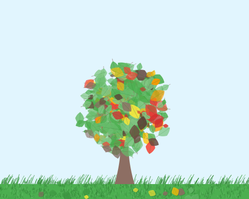

# 🌳 Gomplekity

## Overview

Gomplekity analyzes the cyclomatic complexity of your Go code and generates a beautiful tree visualization.

The leaf colors represent different complexity levels, and the color distribution reflects the proportion of functions at each complexity level.

**Not a serious tool.** A simple Go complexity visualizer that turns your code complexity into a tree with colored leaves.



- 🟢 **Green**: Low complexity (0-9)
- 🟡 **Yellow**: Medium complexity (10-14)
- 🔴 **Red**: High complexity (15-19)
- 🟤 **Brown**: Critical complexity (20+)

## Installation

```bash
go install github.com/masakurapa/gomplekity@latest
```

## Usage

### Basic usage

```bash
# Analyze current directory (outputs PNG by default)
gomplekity

# Analyze specific directory
gomplekity -dir ./src

# Custom output file
gomplekity -output my_project.png

# Generate SVG instead of PNG
gomplekity -output my_project.svg -svg
```

### Advanced options

```bash
# Show detailed analysis
gomplekity -verbose

# Custom complexity thresholds
gomplekity -medium 8 -high 12 -critical 16

# All options with PNG output
gomplekity -dir ./src -output project.png -medium 8 -high 12 -critical 16 -verbose

# All options with SVG output
gomplekity -dir ./src -output project.svg -svg -medium 8 -high 12 -critical 16 -verbose
```

### Options

```
-dir string         Directory to analyze (default ".")
-output string      Output file path (default "complexity_tree.png")
-medium int         Medium complexity threshold (default 10)
-high int           High complexity threshold (default 15)
-critical int       Critical complexity threshold (default 20)
-verbose            Show detailed complexity analysis
-svg                Generate SVG output instead of PNG
-help               Show help message
```

### Sample output

```
✅ Tree visualization saved to: complexity_tree.png
📊 Color distribution: 🟢76.9% 🟡15.4% 🔴7.7% 🟤0.0%
```

---

## Name Origin

"Gomplekity" combines:
- **Go** - The Go programming language
- **Complexity** - Code complexity
- **木 (ki)** - Japanese word for "tree"

But it might help you understand your code complexity in a fun way! 🌳✨

## License

This project uses [github.com/fzipp/gocyclo](https://github.com/fzipp/gocyclo) which is licensed under BSD-3-Clause.
